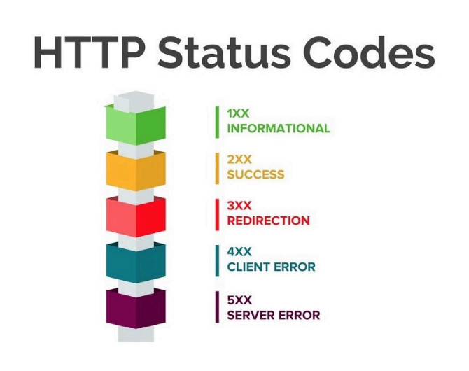

 # PS02_Parsing_Requests
 
 ## Основы работы с библиотекой Requests
 [Программа Парсинга](Request_parsing.py)

 [JSON-Парсинг](Request_JSON.py) 

 [VK-загрузка](Req_VK_DownLoads.py)

 [JSON-Парсинг-Список-Словарь](Request_JSON_Pars_Spisok_Slovary.py)

 [Справочник StatusCod.py](ReqParsStatusCod.py)

